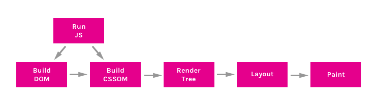
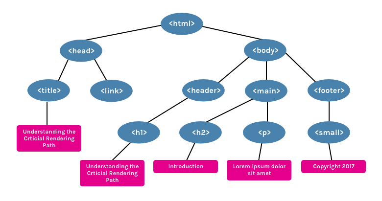
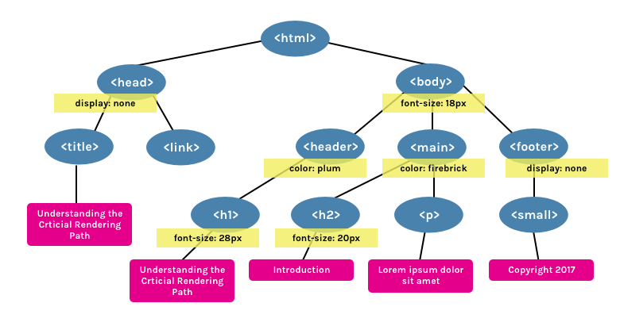
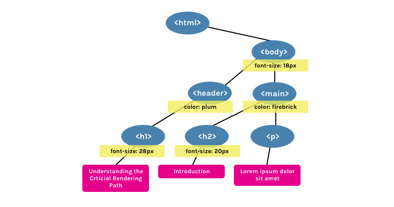

<center>

<small>Photo by [Daniel Cheung](https://unsplash.com/@danielkcheung) on [Unsplash](https://unsplash.com/)</small>

</center>

<h2>들어가며</h2>

대부분의 프로그래밍 언어는 운영체제(Operating System, OS) 위에서 실행되지만 웹 애플리케이션의 자바스크립트는 브라우저에서 HTML, CSS와 함께 실행된다. 브라우저 환경을 고려하며 브라우저가 어떻게 동작하는지 이해하는 것은 효율적인 자바스크립트 프로그래밍의 밑거름이 될 것이다. 해당 포스트는 전반적인 브라우저의 동작 원리를 이해하는 것을 목적으로 작성되었다.

<h2>브라우저의 주요 기능</h2>


<small></small>

브라우저의 핵심 기능은 사용자가 참조하고자 하는 웹페이지를 서버에 요청(Request)하고 서버의 응답(Response)을 받아 브라우저에 표시하는 것이다.

브라우저 주소창에 `www.gogle.com`을 입력했을 때, 브라우저는 서버로부터 HTML, CSS Javascript, 이미지 파일 등을 응답 받는다.
HTML, CSS 파일은 `렌더링 엔진`의 HTML 파서와 CSS 파서에 의해 해석 과정(Parsing)을 거치면서 DOM, CSSOM 트리로 변환되고 렌더 트리에 결합된다. 이렇게 생성된 렌더 트리를 기반으로 브라우저는 사용자에게 웹 페이지를 출력한다.

이때 자바스크립트는 렌더링 엔진이 아니라 `자바스크립트 엔진`이 처리하는데, HTML 파서는 script 태그를 만나면 자바스크립트 코드를 실행하기 위해 DOM 생성을 멈추고 script 태그 내부의 자바스크립트 코드 또는 src 속성에 정의되어 있는 자바스크립트 파일을 로드하고 실행한다.

HTML `script` 태그를 `body` 태그 최하단에 위치시키는 것이 바로 위와 같은 이유에서다. 만약, script 태그를 body 태그 상단에 위치시켰을 경우 DOM이 생성되지 않은 상태로 자바스크립트가 DOM을 조작하는 것이기 때문에 에러가 발생한다. script 태그의 `async`와 `defer` 속성을 활용하면 자바스크립트 로딩 순서를 제어할 수 있지만, 해당 포스트에서는 설명을 생략하겠다.

<h2>브라우저의 기본 구조</h2>


<center>

<small>브라우저의 주요 구성 요소</small>

</center>

**브라우저 사용자 인터페이스(Browser User Interface)**

> - URI를 입력할 수 있는 주소 표시줄
> - 이전 버튼과 다음 버튼
> - 북마크
> - 새로 고침 버튼과 문서의 로드를 중단할 수 있는 정지 버튼
> - 홈 버튼

브라우저의 사용자 인터페이스 구성은 위와 같다. 브라우저의 UI는 표준 명세가 없음에도 불구하고 다양한 브라우저들이 서로 비슷한 UI 구성을 이루고 있는 것을 볼 수 있는데 이를 통해 간접적으로 사용자 관점의 `직관적인 인터페이스`의 중요성과 더 나아가서는 `비즈니스 로직`에 어떠한 영향을 끼치는지를 유추해 볼 수 있다. 현재 브라우저의 모습은 겉으로 볼 때는 그저 심플하게만 보일 수 있지만 그런 모습을 갖추기까지의 그 이면에 있는 무언가를 생각해 보자.

**브라우저 엔진**

> 사용자 인터페이스와 렌더링 엔진 사이의 동작을 제어한다.

**통신**

> HTTP 요청과 같은 네트워크 호출에 사용된다.

**자바스크립트 해석기**

> 자바스크립트 코드를 해석하고 실행한다.

**자료 저장소**

> HTML5 명세에서 지원하는 웹 스토리지(Wep Storage)

**렌더링 엔진**

렌더링 엔진은 요청받은 데이터나 코드를 해석해서 사용자가 시각적으로 볼 수 있게 브라우저 화면에 표시하는 작업을 수행한다.
코드를 해석해서 화면에 표시하는 방식이 브라우저마다 차이가 있는데, 해당 포스트는 사파리와 크롬 브라우저의 `Webkit` 렌더링 엔진을 기준으로 한다.

브라우저가 서버에서 페이지에 대한 HTML 응답을 받으면 화면에 표시되기 전까지 많은 단계를 거쳐야 한다. 해당 과정을 `Critical Rendering Path(CRP)`라고도 하는데, 추후 사이트의 성능을 향상하는 방법을 이해하려면 CRP에 대한 기본 지식이 밑바탕이 되어야 한다.

렌더링 엔진에서는 아래와 같은 CRP 프로세스가 이루어진다.

> - DOM 트리 구축(Constructing the DOM Tree)
> - CSSOM 트리 구축(Constructing the CSSOM Tree)
> - JavaScript 실행(Running JavaScript)
> - 렌더링 트리 구축(Creating the Render Tree)
> - 레이아웃 생성(Creating the Layout)
> - 페인팅(Painting)



**1. DOM 트리 구축(Constructing the DOM Tree)**

HTML 마크업은 여러 태그 간의 관계를 계층적 구조(부모 태그 안의 자식 태그가 있는 형식)로 정의한다. 하지만, 이는 사용자가 시각적으로 확인할 수 있지만, 브라우저에서는 그저 원시 바이트에 불과하다.

HTML 마크업은 렌더링 엔진의 HTML 파서에 의해 파싱`(바이트-토큰-노드-돔트리)`되어 의미가(프로퍼티와 메서드를 갖는) 있는 노드 객체로 변환된다.

파싱되는 과정에서 HTML 마크업의 계층적인 구조를 표현하기 위해 노드 객체를 트리 데이터 구조 내에 연결하는데 이를 DOM 트리라고 한다.

```html
<html>
  <head>
    <title>Understanding the Critical Rendering Path</title>
    <link rel="stylesheet" href="style.css" />
  </head>
  <body>
    <header>
      <h1>Understanding the Critical Rendering Path</h1>
    </header>
    <main>
      <h2>Introduction</h2>
      <p>Lorem ipsum dolor sit amet</p>
    </main>
    <footer>
      <small>Copyright 2017</small>
    </footer>
  </body>
</html>
```

위 HTML 마크업은 파싱되어 아래와 같은 DOM 트리를 생성한다.



이때 렌더링 엔진은 더 나은 사용자 경험을 위해 가능한 빠르게 화면에 내용을 표시하는데 모든 HTML을 파싱할 때까지 기다리지 않고 배치(레이아웃)와 그리기(페인팅) 과정을 시작한다. 네트워크로부터 나머지 내용이 전송되기를 기다리는 동안 받은 내용의 일부를 먼저 표시하는 셈이다.

**2. CSSOM 트리 구축(Constructing the CSSOM Tree)**

위에서 언급한 html 문서의 `style.css` 파일에는 아래와 같은 스타일이 정의되어 있다.

```css
body {
  font-size: 18px;
}

header {
  color: plum;
}
h1 {
  font-size: 28px;
}

main {
  color: firebrick;
}
h2 {
  font-size: 20px;
}

footer {
  display: none;
}
```

위의 CSS는 DOM 트리가 구축되는 과정과 동일하게 (DOM과 Attachment를 쉽게 하려고 비슷한 과정을 거침) CSS 파서에 의해 스타일 시트 객체로 파싱되고 각 객체는 CSS 규칙(Cascade, 종속 및 폭포)을 포함한다.



HTML과는 다르게 CSS는 계단식 상속(body의 하위 요소의 경우 모든 body 스타일 적용) 특성 때문에 부분적으로 실행될 수 없다. 즉, CSS를 완전히 파싱하지 않은 상태로는 렌더링 트리를 구성할 수 없는 셈이다.

**3. JavaScript 실행(Running JavaScript)**

JavaScript는 파서 차단 리소스(Parser blocking resource)로 간주된다. 즉, HTML 파서는 script 태그를 만나면 자바스크립트 코드를 실행하기 위해 DOM 생성 프로세스를 중지하고 자바스크립트 엔진으로 제어 권한을 넘긴다.

자바스크립트 엔진은 script 태그 내의 자바스크립트 코드 또는 src 속성에 정의된 자바스크립트 파일을 로드하고 파싱하여 실행한다.

자바스크립트 실행이 완료되면 다시 HTML 파서로 제어 권한을 넘겨서 브라우저가 중지했던 시점부터 DOM 생성을 재개한다.

**4. 렌더링 트리 구축(Creating the Render Tree)**



DOM과 CSSOM은 결합하여 렌더링 트리를 생성한다. 렌더 트리는 오직 보여지는 콘텐츠만을 캡처한다. 예를 들어 요소에 `display:none`이 적용되어 있다면, 해당 요소 또는 해당 요소가 포함된 하위 요소는 포함되지 않는다. 반면에 `visibility:hidden`은 트리에 포함된다. (전자는 요소가 보이지 않지만, 후자는 공간을 차지하고 있기 때문임)

**5. 레이아웃 생성(Generating the Layout)**

레이아웃 단계에서는 브라우저의 뷰포트(Viewport) 내에서 각 노드 객체에 대한 정확한 위치와 크기를 계산한다(Box-model을 생성함). 렌더링 트리의 노드 객체가 가지고 있는 속성과 스타일에 따라서 브라우저 화면의 어느 위치에 어떤 크기로 출력할지를 결정하는 것이다.

**6. 페인팅(Painting)**

레이아웃이 완료되면 브라우저 화면에 픽셀을 렌더링하는 페인팅 프로세스를 거친다.

**브라우저 렌더링 과정 요약**

- HTML을 처리해서 DOM 트리를 생성한다.
- CSS를 처리해서 CSSOM 트리를 생성한다.
- DOM과 CSSOM을 결합하여 렌더링 트리를 형성한다.
- 렌더링 트리에서 레이아웃 처리를 통해 각 노드의 위치와 크기를 계산한다.
- 개별 노드를 화면에 페인팅한다.

**CRP 최적화**

브라우저 렌더링을 최적화한다는 것은 위의 과정을 최소화하는 프로세스이다. 최적화란 상당히 중요한 문제이며 개발자로서 앞으로 끊임 없이 고민해야 하는 부분이다. 지금은 최적화에 대한 간단한 맥락을 파악했지만, 해당 부분은 추후에 조금 더 공부를 하면서 따로 포스팅을 하도록 해야겠다.

- [Understanding the Critical Rendering Path](https://bitsofco.de/understanding-the-critical-rendering-path/)
- [Critical rendering path / MDN](https://developer.mozilla.org/en-US/docs/Web/Performance/Critical_rendering_path)
