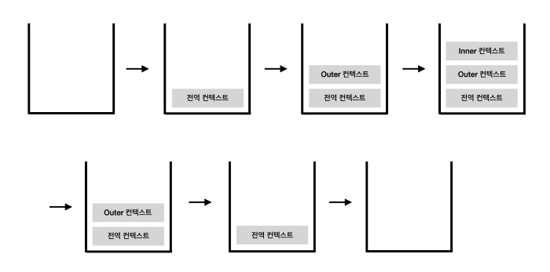

# 들어가며

해당 포스트는 "쉽게 설명하지 못하면 제대로 이해하지 못한 것이다." 라는 아인슈타인의 말을 인용해서 이제 막 개발 공부를 시작한 친구가 이 포스트만을 읽고 고개를 끄덕인다면 성공입니다. 친구에게 전달하듯이 평어를 사용해서 포스팅합니다.

```javascript
var a = 1

function outer() {
  console.log(a) // 1

  function inner() {
    console.log(a) // undefined
    var a = 3
  }

  inner()
  console.log(a) // 1
}
outer()
console.log(a) // 1
```

- 친구 N : `1, 1, 1, 1` 출력을 예상했다.
- 친구 Y : `1, 1, 3, 3` 출력을 예상했다.

# 실행 컨텍스트

위의 코드에서 가장 첫 번째로 어떤 동작이 먼저 일어날까.

먼저 자바스크립트 엔진은 위에서부터 아래까지 차례대로 코드를 훑으면서 실행하려고 할 거야.

하지만, 자바스크립트 엔진은 코드를 실행하기 전에 먼저 코드에 있는 `식별자`를 파악하고 해당 `식별자에 대한 유효 범위` 그리고 `this`에 대한 정보를 수집해.

식별자는 변수명, 매개변수명, 선언한 함수의 함수명 등을 뜻하는 거야. 여기서 `this`는 함께 수집한다. 정도만 알고 넘어가자.

실행 컨텍스트 안에는 위와 같이 코드를 실행하기 위해 필요한 여러 가지 정보가 담겨져 있고 보통 환경 정보라고 얘기를 해. 즉, 실행 컨텍스트란 코드를 실행할 때 필요한 환경 정보를 담은 객체라고 할 수 있어.

개발자가 실행 컨텍스트를 눈으로 직접 확인할 수는 없지만, 실제 자바스크립트 엔진 내부에서 동작하고 있는 내부 메커니즘이야.

모든 코드는 실행 컨텍스트를 통해서 관리되고 자바스크립트 엔진은 실행 컨텍스트라는 객체를 통해서 전체적인 코드의 흐름을 관리하는 셈이지. 실행 컨텍스트는 함수가 실행될 때 생성된다고 보면 돼.


<center>

<small>[스택 오버 플로우](https://stackoverflow.com/) 사이트의 로고</small>

</center>

실행 컨텍스트를 하나의 벽돌 🧱 이라고 생각해 보자. 예를 들어, 위의 코드에서 outer 함수가 실행되면 outer 함수에 대한 실행 컨텍스트가 생성되고 **실행 컨텍스트 스택(Stack)**이라는 공간에 쌓여. 이를 **콜 스택(Call Stack)** 📞 이라고 부르기도 해. 위의 사진 보이지? 실행 컨텍스트를 담는 그릇을 콜 스택이라고 하는 거야.

> 스택(Stack)이 뭐냐고? 스택은 위의 사진처럼 출입구가 하나뿐인 깊은 우물과 같은 데이터 구조야. 순서대로 `a, b, c, d`를 저장했다면, 꺼낼 때는 `d, c, b, a`의 순서대로 꺼낼 수밖에 없는 선입후출 FILO(First In, Last Out) 형태의 구조야.

## 실행 컨텍스트 🧱 구성 요소

코드를 같이 살펴보기 전에 실행 컨텍스트가 어떻게 구성되어 있는지 확인하고 넘어가자.


실행 컨텍스트 객체는 아래의 세 가지로 구성되어 있고 실행 컨텍스트가 생성될 때 이곳에 각각의 정보를 수집해.

- **Variable Environment**

  - environmentRecord
  - outerEnvironmentReference

- **Lexical Environment**

  - environmentRecord
  - outerEnvironmentReference

- **ThisBinding**

## Variable Environment

Variable Environment와 Lexical Environment와 같지만, 실행 컨텍스트가 생성될 때 초기의 상태를 스냅샷으로 유지한다는 점이 달라. `git commit`을 생각하면 이해하기 쉬울 거야. 실행 컨텍스트가 생성될 때 수집된 초기 환경 정보가 원본 상태로 캡처되어서 이곳에 저장되는 거지.

실행 컨텍스트가 생성될 때 먼저 Variable Environment에 정보를 담은 다음, 이를 복사해서 Lexical Environment를 만드는데 이후에는 LexicalEnvironment를 주로 활용해.

## Lexical Environment

Variable Environment는 초기 상태를 유지하는 반면, Lexical Environment는 함수 실행 도중에 변경되는 사항이 즉시 반영되지. 그래서 Lexical Environment를 주로 활용한다는 거야.

이 둘의 내부는 `environmentRecord`와 `outerEnvironmentReference`로 구성되어 있는데 자세한 내용은 아래에서 살펴보자.

### environmentRecord와 호이스팅

`environmentRecord`에는 현재 컨텍스트 안에 있는 코드의 식별자 정보가 저장돼. 컨텍스트 내부 전체를 처음부터 훑어나가며 순서대로 (매개변수 이름, 함수 선언, 변수명 등) 수집하는데 수집이 끝나더라도 코드는 실행되기 전의 상태야.

코드가 실행되기 전에 자바스크립트 엔진은 식별자 정보를 모두 알고 있는 셈이지? 따라서, "자바스크립트 엔진은 식별자들을 최상단으로 끌어올려 놓은 다음 실제 코드를 실행한다."라고 생각하더라도 문제가 되지 않아.

여기서 한 번쯤은 들어본 **호이스팅(hoisting)**이라는 개념이 등장하는데, 호이스팅은 '끌어올린다'라는 뜻이고 코드 해석을 조금 더 수월하게 하기 위해 environmentRecord에 식별자 정보가 담기는 과정을 추상화한 거야.

### 무야~호이스팅!

자바스크립트 엔진이 environmentRecord에 식별자를 수집하면서 이미 식별자 정보를 알고 있으니, 우리는 변수 선언부(식별자)를 코드 최상단으로 끌어올린다고 생각하자! 이렇게 약속한 게 호이스팅이라는 개념이야.

아래는 호이스팅 전의 모습이야.

```javascript
function a() {
  var x = 1
  console.log(x)
  var x
  console.log(x)
  var x = 2
  console.log(x)
}
a()
```

아래는 호이스팅을 마친 상태야. 식별자만 끌어올리고 코드가 실행되는 부분은 원래 자리에 남겨뒀어.

```js
function a() {
  var x
  var x
  var x
  x = 1
  console.log(x)
  console.log(x)
  x = 2
  console.log(x)
}
```

호이스팅이 끝나면 차례대로 코드를 실행하고 콘솔로 찍은 x의 값은 순서대로 1, 2, 2가 출력돼.

### 스코프, 스코프 체인과 outerEnvironmentReference

스코프(scope)란 식별자에 대한 유효범위야. 이러한 식별자의 유효 범위를 안에서부터 바깥으로 차례대로 검색해 나가는 것을 스코프 체인(scope chain)이라고 해.

그리고 이 모든 것을 가능케 하는 게 Lexical Environment의 두 번째 수집 자료인 `outerEnvironmentReference`야.

outerEnvironmentReference는 가장 직전 컨텍스트의 `Lexical Environment`를 참조하는데 이를 통해서 직전 컨텍스트의 식별자에 접근할 수 있게 되는 거야.

가장 첫 번째 예시로 돌아가서 전체적인 흐름을 살펴보자.

```js
var a = 1

function outer() {
  console.log(a) // 1

  function inner() {
    console.log(a) // undefined
    var a = 3
  }

  inner()
  console.log(a) // 1
}
outer()
console.log(a) // 1
```



- 먼저 코드 전역에 걸쳐서 전역 실행 컨텍스트가 생성되고 콜 스택에 쌓여. 전역 컨텍스트의 enviornmentRecord에는 `var a;`와 `outer` 함수의 선언부, 즉 outer 함수 전체가 담기게 되겠지.

- 컨텍스트 내에 정보 수집을 끝내면 윗줄부터 순서대로 코드가 실행돼. 그래서 변수 a에는 1이라는 값이 할당되지.
- outer 함수가 실행되면서 outer 컨텍스트가 생성되고 콜 스택에 쌓여. outer 컨텍스트가 생성되면서 outer 컨텍스트의 environmentRecord에 `inner` 함수의 선언부가 담기게 되고 이어서 `console.log(a)`가 실행되는데 outer 컨텍스트에는 식별자 `a`에 대한 정보가 없지?

- 이때 outer 컨텍스트의 outerEnvironmentReference를 통해서 상위 컨텍스트 즉, 전역 컨텍스의 Lexical Environment에 접근할 수 있게 되고 environment에 저장되어 있는 식별자 `a`를 참조할 수 있어.

- 식별자 `a`에는 값이 1이라는 값이 할당되어 있으니 outer 함수 내의 `console.log(a)`에는 `1`이 출력되는 거야.

- inner 함수가 실행되면서 inner 컨텍스트가 생성되었고 environmentRecord에 식별자 `var a;`를 수집해.

- 이어서 `console.log(a)` 코드를 실행하는데 inner 컨텍스트 environmentRecord에 수집된 식별자 정보는 있지만, 값이 할당되기 전의 상태지. 이런 경우에 `undefined`이 반환 돼. environmentRecord에 수집된 식별자 정보가 없을 때만 outerEnvironmentReference를 통해서 상위 컨텍스트에 접근해서 참조하는 거야.

- 다시 inner 함수 내의 코드가 진행되면서 변수 a에 3이 할당되고 inner 컨텍스트는 콜 스택에서 제거돼.
- `inner()` 아래의 `console.log(a)`가 실행되는데 outer 컨텍스트 environmentRecord에 식별자 `a`가 없기 때문에 outerEnvironmentReference를 통해서 전역 컨텍스트의 Lexical Environment에 접근하고 environmentRecord에 있는 `1`을 출력하게 되는 거야.
- outer 함수가 할 일을 끝냈으니, 콜 스택에서 제거되고 마지막 남은 `conosole.log(a)`를 실행하는데 이는 전역 컨텍스트의 environmentRecord에 바로 저장되어 있지? 그래서 1이 출력되는 거야.
- 마지막으로 코드가 모두 종료되었으니 전역 컨텍스트도 콜 스택에서 제거 돼.

마지막으로 [GIF](https://miro.medium.com/max/1100/1*dUl6qPEaDJJTXWythQsEtQ.gif)를 참고하면 조금 더 도움이 될 거야.

# 키워드 요약

- 실행 컨텍스트(Execution Context)

  - Variable Environment
  - Lexical Environment
    - - environmentRecord : 식별자 수집 (hoisting)
        - 호이스팅 과정에서 함수 선언문과 함수 표현식에 대한 차이가 발생하는데, 함수 선언문의 경우는 함수 전체가 호이스팅 되기 때문에 함수 표현식을 사용하는 것을 추천!
      - outerEnvironmentReference : 직전 컨텍스트의 Lexical Environment를 참조 (scope chain)
  - ThisBinding
    - - this로 지정된 객체가 저장

- 전역 변수 : 전역 컨텍스트의 LexicalEnvironment에 담긴 변수

  - 안전한 코드 구성을 위해 가급적 전역변수의 사용은 최소화해야 해.

- 지역 변수 : 그 밖의 함수에 의해 생성된 실행 컨텍스트의 변수

> PS. D & Y가 이 포스트를 읽고 실행 컨텍스트란 무엇인지 알 수 있기를 바라면서 둘을 특정했던(?) 포스팅을 마친다. 그냥 알고 있는 것과 타인이 이해할 수 있도록 작성하는 것은 너무나도 큰 차이인 것 같다. 이 사이의 간극을 조금이나마 줄일 수 있도록 계속 쉽게 쓰는 연습을 해야겠다.
