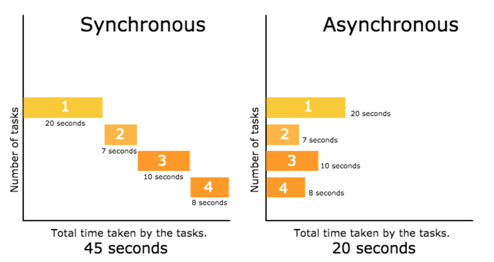
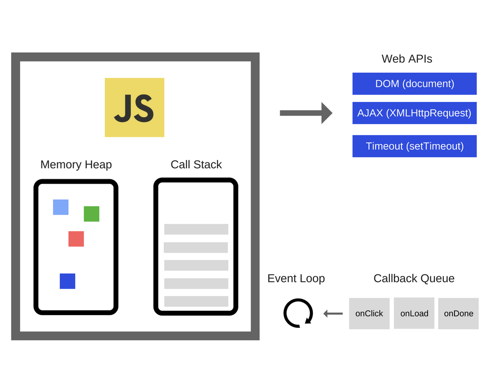

자바스크립트는 싱글스레드로 동작하는 언어이다. 싱글스레드는 말 그대로 한 번에 하나의 작업만 수행할 수 있음을 의미한다. 자바스크립트 엔진은 기본적으로 특정 코드의 연산이 끝날 때까지 기다렸다가 연산이 종료되면 그때야 다음 코드를 차례대로 실행하는 `동기적인` 처리 방식으로 작업을 수행한다.

만약 작업을 동기적으로 처리한다면 작업(특정 코드의 연산)이 끝날 때까지는 중지 상태가 되기 때문에 다른 작업(다음 코드의 실행)을 할 수 없으며 해당 작업이 끝나야 비로소 그다음의 예정된 작업(다음 코드의 실행)을 할 수 있다.

하지만 이를 `비동기적으로` 처리를 한다면 흐름이 멈추지 않기 때문에 동시에 여러 가지 작업을 처리할 수도 있고 기다리는 과정에서 다른 코드를 실행할 수도 있다.

싱글스레드 기반의 자바스크립트가 빠르게 동작하면서 여러 가지 작업을 동시에 수행하는 동시성을 가질 수 있는 것은 자바스크립트 엔진이 비동기적인 처리를 지원하기 때문이다. (자바스크립트 외부의 요소들과 상호작용이 가능하도록 연결해주는 셈이다.)

# 자바스크립트는 어떻게 비동기적인 처리를 지원할까?



### 자바스크립트 엔진

- 콜 스택(call stack) : 코드가 실행되면서 스택 형태로 쌓이는 공간
  - 특정 코드가 실행될 때, 콜 스택에 새로운 프레임이 쌓이고 실행이 끝나면 해당 프레임은 제거된다.
- 메모리 힙(memory heap) : 메모리가 할당을 담당하는 공간

대부분의 자바스크립트 엔진은 내부적으로 콜 스택과 메모리 힙 두 가지 영역으로 구성되어 있다.

### 런타임 (엔진 외부적인 요소)

- Wep APIs (DOM, AJAX, Timeout)
- Callback Queue
- Event Loop

외부적인 요소에는 브라우저에서 제공되는 Wep APIs가 있으며 이벤트 루프와 콜백 큐가 있다.

### 비동기 처리의 좋은 예

비동기 처리의 대표적인 예로 setTimeout 함수가 있다. setTimeout은 Web API의 한 종류이다. 해당 함수는 지정한 시간이 지나면 전달한 콜백(callback) 함수를 호출한다.

```js
console.log('1')
setTimeout(() => console.log('2'), 5000)
console.log('3') // 1, 3, 2
```

setTimeout () 함수가 실행되는 과정은 다음과 같다.

가장 첫 번째로 콜 스택에 `console.log('1')` 작업이 등록되고 동시에 완료되며 숫자 `1`이 출력된다. 이후 setTimeout 함수가 실행되고 콜 스택에 setTimeout 작업이 등록된다.

setTimeout 함수는 자바스크립트 엔진이 처리하지 않고, Web API가 처리하기 때문에 setTimeout에 담긴 콜백 함수를 전달함과 동시에 Web API에 setTimeout 작업을 요청한다.

콜 스택에 쌓여있던 setTimeout 작업은 제거되며 `console.log('3')` 작업이 등록된다. `console.log('3')` 작업이 완료되면 숫자 `3`이 출력된다.

이후 Web API는 방금 요청받은 `setTimeout` 함수를 실행한다. 5000ms가 지나면 전달받은 콜백 함수를 Callback Queue에 넘겨준다.
Callback Queue에서 대기 중인 console.log('2') 콜백 함수가 콜 스택으로 전달되어 실행되고 숫자 `2`가 출력된다.

> Callback Queue는 Web API에서 넘겨받은 콜백 함수를 저장하는 공간이다. 이 콜백 함수들은 Callback Queue에서 대기하다가 자바스크립트 엔진의 콜 스택이 비었을 때, 콜 스택으로 이동하게 된다. 이때, 이벤트 루프가 콜 스택이 비어있는지 아닌지, Callback Queue에 콜백 함수가 존재하는지 아닌지 판단하는 역할을 한다. Callback Queue는 Task Queue라고도 불린다.

### 정리하자면

싱글스레드 기반의 자바스크립트는 자체적으로 비동기적인 처리를 할 수 없다. 하지만 자바스크립트 런타임 구성요소인 Web API를 통해서 비동기적인 처리가 가능하다. 자바스크립트 엔진은 Web API에게 비동기 처리를 위임하기 때문에 진행 중인 작업을 중단하지 않고 계속 진행할 수 있는 것이다.

**Reference**

- [How JavaScript works: an overview of the engine, the runtime, and the call stack](https://blog.sessionstack.com/how-does-javascript-actually-work-part-1-b0bacc073cf)
